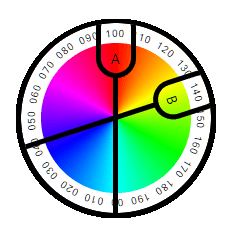

# ImageMagick Modulate Calculator

This demo calculates the resulting hue when a modulate command is applied to a source color. 

 
  
🌎 You can view the live version here:  
https://r0d3r1ck0rd0n3z.github.io/ImageMagick-Modulate-Calculator/

 

Modulate is an ImageMagick command that can shift the hue of a given color by the provided percentage. Note that while modulate can also change the brightness and saturation of target images, this demo <i>focuses on <b>hue</b> only</i>. <a target='_blank' href='https://legacy.imagemagick.org/Usage/color_mods/#modulate_hue' title='Hue Modulation'>More info here</a>. 

To understand how this 'hue shift' works, imagine a colorwheel where:

  A = original color, used as a base for the computations 
  B = new color, as shifted from A by 𝒏 percent

ImageMagick takes the base color and assigns it a value of 100%. It then works out the % values of the other colors :  
  <ul>
  <li>The opposite color on the wheel is assigned 0%.</li>
  <li>Starting from this 0% value, it moves clockwise along the colorwheel perimeter adding 1% for each color until it reaches 200%.</li>
  <li>By this point, it has already circled back to 0%. Logically, this means that colors bearing the 0% and 200% values are the same.</li>
</ul>

  Now, when a user provides a percentage, ImageMagick simply returns the color associated with that % value. 

 

## Current issues

* The demo may have issues if the HSL input does not strictly follow the <tt>hsl( xx , xx% , xx% )</tt> format.
* Rounding errors may occur that can shift the resulting hue by 1~4%. Always try to double-check the results using another tool.
* I've tried my best to anticipate possible errors, but results may be off if it encounters unconventional inputs.
